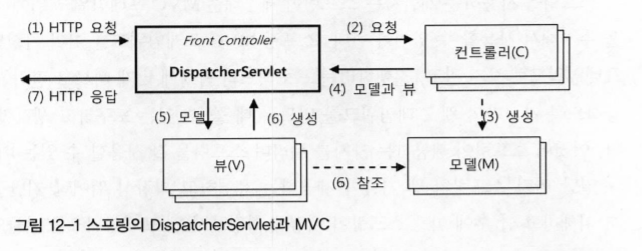

# 도입

앞서 핸들러 어댑터, 메서드 파라미터 바인딩 등의 여러 MVC 관련 포스팅을 했었다.

이제 컨트롤러가 반환을 할 때는 어떤 흐름이 일어나는지 알아보고자 한다.

# 전체 흐름



위 그림에서 3번부터 7번까지 간략히 무엇을 하는지 알아보자.

3. 컨트롤러가 모델에 정보를 이름과 오브젝트 값의 쌍으로 넣는다.

4. 뷰를 생성하거나 뷰의 이름을 `ModelAndView`에 모델과 함께 넣어 반환한다. 
   
   * 뷰의 이름을 반환하면 `DispatcherServlet`의 `ViewResolver`가 알아서 해당 뷰 오브젝트를 생성해준다.
   
   * 2번과 4번에서 `DispatcherServlet`과 `컨트롤러` 사이에는 `HandlerAdapter`가 프록시 역할을 하는 것을 잊지 말자.
     4번에서는 `HandlerAdapter`가 컨트롤러가 `ModelAndView`타입으로 반환하지 않아도 `ModelAndView` 형태로 만들어 반환해준다.
    
   * View 대신 메시지 컨버터를 사용하면 반환하는 값을 바로 HTTP 응답 바디로 다룰 수 있다.
   
5. 뷰 오브젝트에 모델을 전달해주고 최종 결과물을 생성해달라고 요청한다.

6. 뷰는 모델을 참조해서 결과물을 `HttpServletResponse` 형태로 반환한다.

   * 예로 JstlView는 모델과 컨트롤러가 돌려준 JSP 뷰 템플릿의 이름을 가져다 HTML을 생성한다.
   
7. `DispatcherServlet`은 등록된 후처리기가 있으면 진행한 후, `HttpServletResponse`를 컨테이너에 넘긴다. 
    컨테이너는 이를 HTTP 응답으로 클라이언트에 전송한다.

아래부터는 응답 결과를 만들어주는 `View`, `ViewResolver`, `MessageConverter`에 대해 간단히 알아보자.

# View

> MVC 아키텍처에서 모델이 가진 정보를 어떻게 표현해야 하는지에 대한 로직을 갖고 있는 컴포넌트.

```java
public interface View{
    String getContentType();
    void render(Map<String, ?> model, HttpServletRequest request
            , HttpServletResponse response) throws Exception;
}
```

## Spring에서 제공하는 View

### InternalResourceView 과 JstlView

> 다른 서블릿을 실행해서 그 결과를 현재 서블릿의 결과로 사용하거나 추가하는 방식으로, 주로 사용하는 View이다.

스프링 MVC의 컨트롤러에서 `InternalResourceView`를 만들어 `ModelAndView`에 넣어서 `DispatcherServlet`
으로 넘겨주면 JSP로 포워딩하는 기능을 가진 뷰를 사용할 수 있다.

> JstlView는 InternalResourceView의 서브 클래스로 지역화된 메시지를 JSP 뷰에서 사용할 수 있는 등 추가 기능을 활용할 수 있다.

뷰 리졸버를 사용한다면 아래와 같이 JSP 파일의 위치를 나타내는 논리적인 뷰 이름만 넘겨주면 된다.

```java
return new ModelAndView("/WEB-INF/view/hello.jsp", model);
```

뷰 오브젝트 대신 뷰 이름이 `ModelAndView`에 담겨서 돌아오면, DispatcherServlet이 디폴트 전략인
`InternalResourceViewResolver`를 통해 `InternalResourceView`를 가져와 사용한다.

### MappingJackson2JsonView

> 모델의 모든 오브젝트를 JSON으로 변환해주는 뷰

이 뷰를 직접 사용하기 보다 메시지 컨버터를 사용해 생성하는 방법이 편하다.

### RedirectView

> HttpServletResponse의 sendRedirect()를 호출해주는 기능을 가진 뷰

아래와 같이 사용할 수 있다.

```java
return new ModelAndVide("redirect:main");
```

위 같은 경우에는 서버의 `루트 URL/main` 으로 넘어가게 된다.

다른 서버로 리다이렉트하려면 `redirect:http://`로 시작하면 된다.


### 기타

이 외에도 여러 뷰가 있는데 다음 링크에서 `all known implementing Classes` 부분을 참고하길 바란다.

[spring docs : View](https://docs.spring.io/spring-framework/docs/current/javadoc-api/org/springframework/web/servlet/View.html)

이 때까지 몇가지 `View`들을 살펴보았다. 

실제로 `View` 객체를 생성해서 `ModelAndView`에 넣어 반환하는 것보다는 `ViewResolver`를 쓰는 것이 편하다.

`ViewResolver`에 대해 간단히 알아보자.

# ViewResolver

> 핸들러 매핑이 URL로부터 컨트롤러를 찾아주는 것처럼, 뷰 이름으로부터 사용할 뷰 오브젝트를 찾아준다.

## InternalResourceViewResolver

> 자동으로 등록되는 디폴트 뷰 리졸버로서, InternalResourceView를 지원한다.

JSP를 뷰로 사용할 때 쓰이며, prefix, suffix를 지정할 수 있다.

이 외에도 템플릿 엔진인 `Thymeleaf`를 지원하는 뷰 리졸버 등 여러 뷰 리졸버들이 있다. 

어떤 뷰 타입을 사용하려 할때, 지원하는 뷰 리졸버의 사용법을 찾아 사용해보자. 

# 메시지 컨버터

> 모델 오브젝트를 다시 뷰를 이요해 클라이언트로 보낼 콘텐트로 만드는 대신, 
> HTTP 요청 메시지 본문과 HTTP 응답 메시지 본문을 통째로 메시지를 다루는 방식.

메시지 컨버터는 요청 메시지를 파라미터에 바인딩하거나, 오브젝트를 응답 메시지로 바인딩할 때 쓰인다. 

이번 주제는 컨트롤러의 return할 때 무슨 일이 일어나는지 보는 것이므로 후자를 살펴보자.

> 전자는 앞서 작성한 [@MVC는 HttpRequest에서 어떻게 원하는 형태로 데이터를 전달받아 사용할 수 있을까?]()
> 을 참고하길 바란다. 

메시지 컨버터를 사용할 때는 `@ResponseBody` 어노테이션을 핸들러 메서드에 위에 붙여서 사용할 수 있다.

여러가지 메시지 컨버터가 있으나 주로 `MashallingHttpMessageConverter`나 `MappingJackson2HttpMessageConverter`를 주로 사용한다.

우리는 `MappingJackson2HttpMessageConverter`만 간단히 알아보자.

## MappingJackson2HttpMessageConverter

> Jackson ObjectMapper를 이용해서 자바 오브젝트와 JSON 문서를 자동변환해주는 메시지 컨버터이다. 
> 지원 미디어 타입은 application/json이다.

만약 다음과 같이 반환하게 되면 `User`가 그대로 HttpResponse Body에 Json 형식으로 담기게 된다.

```java
@RequestMapping("/api/hello")
@ResponseBody
public User hello(){
    return new User("hello", "world");
}
```

> Jackson 라이브러리는 오브젝트의 프로퍼티에 접근할 때 get 메서드를 사용하므로 이를 제공해줘야한다.

# 참조

* 토비의 스프링 3.1